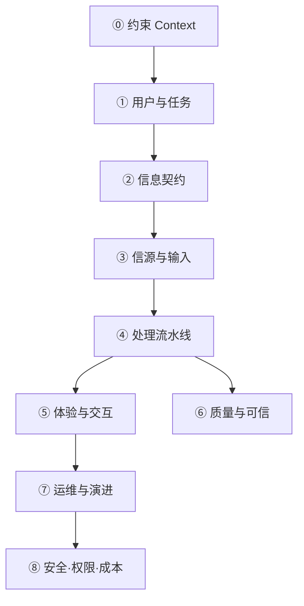

# 通用架构思考框架

> 适用于任意类型项目（情报站、内部工具、SaaS、数据管道、自动化平台等）。  
> 与 [PROJECT_ROADMAP.md](./PROJECT_ROADMAP.md) 中的 **Layer A–E / Gate G1–G5** 互补：本文是**跨项目的思维清单**；Roadmap 是**本项目的落地实例**。

---

## 一、核心观念

### 1.1 架构不是终局蓝图

- **不可能**在 Day 1 设计完整方案；现实是 **MVP → 补丁 → 分层 → 扩展 → 升级**。
- 合格架构师的目标不是「一次设计对」，而是：
  1. 分清**现在必须对**的决策（难改）与**可以晚做**的决策（易改）
  2. 为每种「长大后的痛」预留 **接缝（seam）** 和 **触发条件（trigger）**
  3. 每个迭代只 **闭合一个环**，用 Gate 验收后再开下一层

### 1.2 架构 = 约束下的决策记录

架构产出物不仅是代码/目录，还包括：

| 产出 | 说明 |
|------|------|
| **任务卡片** | 谁、什么场景、怎样算成功、明确不做什么 |
| **信息契约** | 字段、来源、融合规则、缺失策略 |
| **演进触发器** | 什么指标出现 → 做什么改造 → 仍不做什么 |
| **ADR（可选）** | Architecture Decision Record：重要决策 + 理由 + 放弃的方案 |

---

## 二、八维思考框架（通用）

每个新项目或每个迭代，按顺序过一遍。**不必八维全做**；用文末「迭代 Checklist」打勾即可。



---

### ⓪ 约束（Context）— 比需求更早

**问什么**

| 问题 | 示例答案（因项目而异） |
|------|------------------------|
| 部署形态？ | 静态站 / 自托管 / 云 SaaS |
| 预算与人力？ | 零运维 / 小团队 / 有后端人力 |
| 合规与隐私？ | 公开数据 / 含商业敏感 / 含个人信息 |
| 更新频率？ | 实时 / 日更 / 周更 / 按需 |
| 技术栈偏好或限制？ | 必须 GitHub Pages / 必须 Python 等 |

**产出**：一页「约束与不做」清单。

**原则**：约束会直接淘汰大量方案（例如静态站 → 默认无服务端 Session）。

---

### ① 用户与任务（Problem）

**问什么**

- 主用户是谁？（只选一个主角色）
- 核心场景是什么？（一个具体故事，不是功能列表）
- 触发条件？（用户什么时候打开这个系统）
- 成功标准？（3 条可验证的标准）
- 非目标？（3 条「本阶段不做」）

**产出**：**任务卡片**（模板见 §五）。

**原则**：没有「不做」清单，架构会无限膨胀。

---

### ② 信息契约（Information Contract）

**问什么**

- 系统对外「承诺」的核心数据是什么？（实体：产品 / 订单 / 文章 / 监控项…）
- P0 字段有哪些？（建议 ≤15）
- 每个字段：主信源、备信源、置信度、缺失时如何展示
- 多源冲突时的融合规则
- 数据保留窗口？（如 30 天滚动 vs 永久归档）

**产出**：字段表 / schema / `field_annotations` 类文档。

**原则**：**契约先于 UI、先于爬虫**；契约变更是最贵的变更。

---

### ③ 信源与输入（Sources）

**问什么**

- 数据从哪来？（API / RSS / 爬虫 / 人工 CSV / 用户上传）
- 信源如何**逻辑分层**？（原始 / 增强 / 官方 / 第三方…）
- 各层负责填哪些字段？
- 抓取频率、失败降级、robots/合规
- 增量 vs 全量

**产出**：信源分层图 + 每层输入输出说明。

**原则**：信源分层是**逻辑结构**，不必等于数据库分层。

---

### ④ 处理流水线（Processing / ETL）

**问什么**

- 分几个阶段？（采集 → 清洗 →  enrich → 聚合 → 发布）
- 每阶段输入/输出格式？（目录、表、API）
- 能否**单条重跑**？（一条 report / 一个 watch / 一个 SKU）
- 是否幂等？（同一输入多次运行结果一致）
- 构建时算还是运行时算？（**能构建时算就不要运行时算**）

**产出**：流水线图 + 各 stage 脚本/服务边界。

**原则**：先 ETL + 物化视图；数据库是规模上来后的升级选项，不是默认起点。

---

### ⑤ 体验与交互（Experience）

**问什么**

- 用户从哪几个**视角**读数据？（时间 / 实体 / 品类 / 信源 / 对比…）
- 主路径几步完成核心任务？（目标 ≤3 次点击）
- 哪些交互纯前端即可？（筛选、勾选、URL 分享、localStorage）
- 哪些交互必须要后端？（登录、协作编辑、实时通知）

**产出**：路由/页面表 + 主路径描述。

**原则**：**预计算 + 客户端交互** 与 **服务端有状态** 是不同架构；不要混为一谈。

---

### ⑥ 质量与可信（Quality & Trust）

**问什么**

- 错了谁承担？最坏情况是什么？
- 如何追溯来源？（字段级 provenance）
- 如何衡量完整度？（completeness score）
- 如何发现错误？（构建报告、抽样 audit）
- 降级策略？（缺 OCR 仍链原文）

**产出**：质量指标 + 空值/低置信度展示规范。

**原则**：数据类 / 成本类 / 合规类项目，此维度优先级高于「功能多」。

---

### ⑦ 运维与演进（Operations & Evolution）

**问什么**

- 如何部署？如何回滚？
- 构建/任务是否可观测？（耗时、失败率、增量条数）
- **演进触发器**：什么信号出现就该升级架构？（见 §三）
- 备份与灾难恢复（数据仓库体积、git 历史）

**产出**：演进触发器表 + 最小监控（哪怕只是 `build_summary.json`）。

**原则**：动态因素用 **触发器** 管理，不要 Day 1 设计弹性架构。

---

### ⑧ 安全、权限、成本（Security & Scale）— 按需启用

**问什么**

| 主题 | 何时认真做 |
|------|------------|
| **访问规模（QPS/用户数）** | 静态站/CDN 通常不是瓶颈；先看构建时间与存储 |
| **数据规模** | 实体数、单行大小、历史保留 |
| **权限（RBAC）** | 出现多用户写入、敏感数据、租户隔离时 |
| **成本** | LLM 调用、浏览器抓取、代理、DB 托管 |
| **安全** | 用户输入、Webhook、SSRF、密钥管理 |

**产出**：威胁面简表 + 「当前阶段不做权限」的显式声明。

**原则**：留 **接缝**（数据层与将来 API 分离），不必提前实现。

---

## 三、演进触发器（通用模板）

复制下表到具体项目，填上**你的**阈值。

| 信号 | 当前方案 | 升级方向 | 仍不做 |
|------|----------|----------|--------|
| 实体规模 | | 增量 build / 分片 | |
| 构建时间 | | 并行 / 缓存 / 增量 | |
| 查询模式 | 预生成 JSON | SQLite / API | |
| 写入方 | 仅 pipeline | DB + 简单 API | |
| 用户数 | 公开只读 | Auth / RBAC | |
| 敏感数据 | 公开 | 私有部署 + 访问控制 | |
| LLM 成本 | 构建时批处理 | 缓存 /  smaller model | 运行时逐用户 LLM |
| 信源失败率 | | 重试 / 代理 / 降频 | |

**用法**：每个迭代花 5 分钟更新「当前处于哪一格」；未触发则不升级。

---

## 四、ETL vs 数据库 — 决策简表

| 维度 | ETL + 文件/物化视图 | 数据库 + API |
|------|---------------------|--------------|
| 部署 | 轻（静态站、对象存储） | 重（DB、后端、备份） |
| 适用 | 读多写少、日更/周更、小团队 | 多写入、复杂查询、多租户 |
| 查询 | 视图需预生成 | ad-hoc SQL |
| 一致性 | 构建快照 | 需处理并发 |
| 演进 | 先走这条 | 触发器满足后再加 |

**默认建议**：没有明确触发信号前，选 **ETL + 物化视图**。

---

## 五、任务卡片模板（复制即用）

```markdown
## 任务卡片：[迭代名]

**主用户**：
**场景**：（一句话故事）
**触发**：（用户何时需要）
**成功标准**：
1.
2.
3.
**本阶段不做**：
1.
2.
3.
**主路径**：（≤3 步）
**P0 字段**：（≤15，链到信息契约）
**Gate 自检**：G1 ☐ G2 ☐ G3 ☐ G4 ☐ G5 ☐
```

---

## 六、迭代 Checklist（15 分钟版）

每个迭代开工前：

- [ ] **⓪** 约束与「不做」已更新
- [ ] **①** 任务卡片已写，主用户唯一
- [ ] **②** P0 字段与缺失策略已定义/更新
- [ ] **③** 新信源已分层并文档化
- [ ] **④** 流水线阶段清晰，可单条重跑
- [ ] **⑤** 主路径 ≤3 点击，交互是否需要后端已分清
- [ ] **⑥** 来源/完整度/降级策略已考虑
- [ ] **⑦** 构建可观测，演进触发器已扫一眼
- [ ] **⑧** 权限/规模：仅当触发信号出现才开项

---

## 七、与「工程师 / 架构师 / 产品」的关系

| 角色倾向 | 典型关注点 | 你描述的框架接近度 |
|----------|------------|-------------------|
| **产品** | 用户价值、场景、优先级 | ① 用户与任务 |
| **工程师** | 实现、MVP、迭代、脚本能跑 | ②③④ + 「交给 AI 快速做」 |
| **架构师** | 约束、契约、边界、演进、质量、成本 | ⓪②⑥⑦⑧ + 触发器 |
| **运维/SRE** | 部署、监控、故障、扩展 | ⑦⑧ |

**客观结论**

- 你原来的三维（需求 → 系统设计 → 权限规模）≈ **偏工程师 + 少量架构前瞻**，约占完整面的 **40–50%**。
- 补上 **约束、信息契约、质量可信、运维演进** 后，更接近 **「做架构的工程师」** 或 **Solution Architect**——能落地，也留演进。
- 纯「架构师」若只画图、不写 Gate、不定义契约，容易 over-engineer；纯「工程师」若只堆功能、不写过不做清单，容易补丁债。**合格建设者是两者结合**。

---

## 八、与本项目（52 情报站）的映射

| 通用维度 | 本项目实例 |
|----------|------------|
| ⓪ 约束 | GitHub Pages、成本工程师单角色、日更 |
| ① 任务 | 品类对标、30 分钟 P0 对比 |
| ② 契约 | `field_annotations.json`、P0≤15 |
| ③ 信源 | technical / channel / official / review |
| ④ ETL | crawl → build_products → build_matrix → Astro |
| ⑤ 体验 | 矩阵 / 勾选对比 / 产品档案 / 报告溯源 |
| ⑥ 质量 | V6：layer_refs、completeness、OCR 置信 |
| ⑦ 演进 | CI 构建、Gate G1–G5 |
| ⑧ 权限 | 当前不做；触发：多人标注 / 敏感渠道价 |

---

## 九、推荐阅读顺序

1. 本文（通用框架）
2. [PROJECT_ROADMAP.md](./PROJECT_ROADMAP.md)（本项目 Layer A–E 落地）
3. 具体版本架构（V4/V5/DESIGN）

---

*文档类型：跨项目方法论文档 · 最后更新：2026-07-09*
