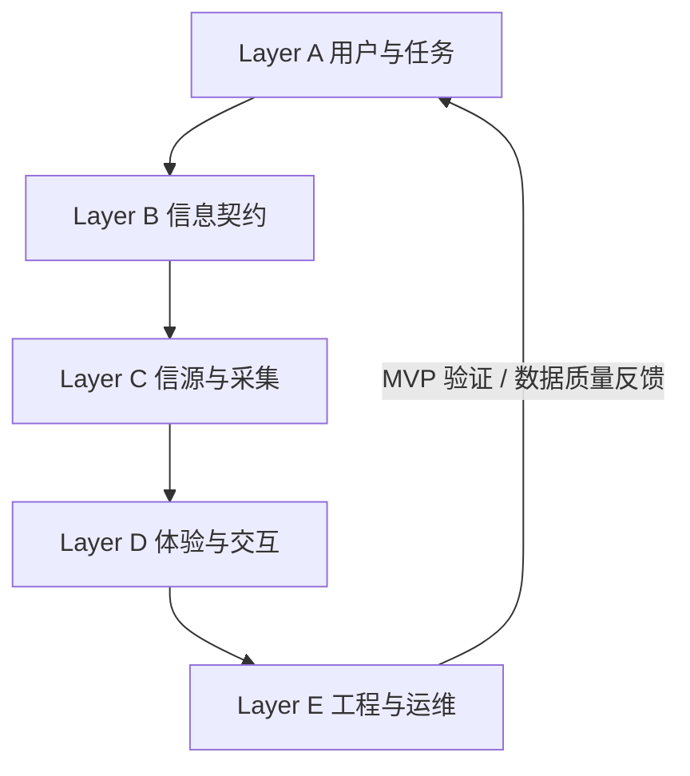
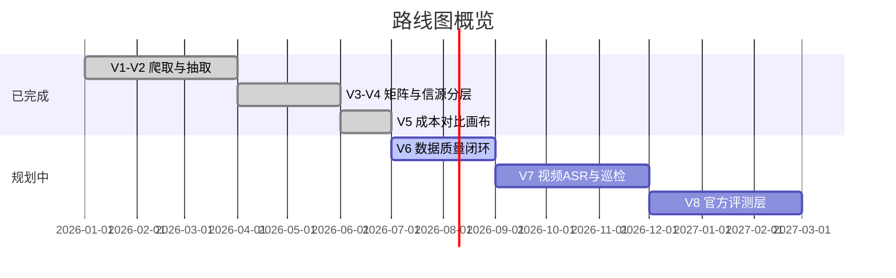

# 52 情报站 — 项目目标、开发方式与路线图

> 本文档定义项目的 North Star、五层开发框架、各层现状与未来方向，以及迭代 Gate 与版本规划。  
> 与 [DESIGN.md](./DESIGN.md)（数据源与抽取设计）、[ARCHITECTURE_V4.md](./ARCHITECTURE_V4.md)（成本工程师架构）、[ARCHITECTURE_V5_UI.md](./ARCHITECTURE_V5_UI.md)（当前 UI）互补阅读。

---

## 目录

- [一、项目目标](#一项目目标)
- [二、开发方式（五层螺旋）](#二开发方式五层螺旋)
- [三、五层架构：现状与未来](#三五层架构现状与未来)
- [四、版本路线图](#四版本路线图)
- [五、开发宪章](#五开发宪章)
- [六、迭代工作单模板](#六迭代工作单模板)
- [七、相关文档](#七相关文档)

---

## 一、项目目标

### 1.1 一句话目标

**把音频/穿戴类竞品的拆解情报，结构化成可检索、可对比、可追溯的成本分析工作台，让成本工程师在立项对标时能快速回答「这款产品拆了啥、用了啥料、卖多少钱」。**

### 1.2 主用户与核心任务

| 维度 | 定义 |
|------|------|
| **主用户** | 成本工程师（V5 前端专注此角色） |
| **核心场景** | 立项前竞品对标（如耳夹旗舰、TWS、骨传导等） |
| **核心任务** | 按品类筛选 → 勾选 3–8 款产品 → 横向对比 BOM/芯片/电池/售价 → 下钻单款档案 → 回溯 52audio 原文 |
| **成功标准** | 30 分钟内完成一组竞品 P0 成本字段对比；关键字段有来源标注；缺失字段有明确展示策略 |
| **非目标（当前版本）** | 不做多角色前端（PM/结构/硬件/软件透镜）、不做登录协作、不做实时 API 服务 |

### 1.3 产品价值主张

相对直接浏览 [我爱音频网拆解分类](https://www.52audio.com/archives/category/teardowns)，本项目的增量价值：

1. **结构化** — 从长文中抽出 BOM、芯片、电池、卖点、部件等可对比字段
2. **聚合** — 按品类矩阵浏览全产品，而非逐篇读报告
3. **对比** — 用户自选产品列，生成横向对比表
4. **融合** — 技术层 + 渠道层数据合并（售价、BOM 完整度优先）
5. **可追溯** — 每条结构化数据可链回 52audio 原文证据

---

## 二、开发方式（五层螺旋）

### 2.1 总体原则

开发不是「定用户 → 找数据 → 选技术 → 做 UI」的直线瀑布，而是按五层**同步推进、小步闭环**：



| 层级 | 职责 | 关键规则 |
|------|------|----------|
| **A 用户与任务** | 为谁服务、什么场景、怎样算成功 | 先定主用户，拒绝同时服务五个角色 |
| **B 信息契约** | 字段清单、可信度、缺失策略、融合规则 | **先于信源深挖**；P0 字段 ≤15 |
| **C 信源与采集** | 数据源分层、爬虫、OCR、CSV enrich | **按层切片**；每层单独闭合 |
| **D 体验与交互** | 页面流、对比范式、空值展示 | **与 A 同步设计**，不放到最后 |
| **E 工程与运维** | 存储、构建、部署、更新频率 | **由约束反推**，不先选数据库 |

### 2.2 每个迭代只闭合一个环

| 版本 | 闭合能力 | 状态 |
|------|----------|------|
| V1 | 能爬 → 能看报告/视频列表 | ✅ 已完成 |
| V2 | 能抽卖点/部件/技术参数 → 详情页 | ✅ 已完成 |
| V3 | 矩阵/对比 + 多角色透镜设计 | ⚠️ 设计完成，前端已收窄 |
| V4 | 四层信源 + 产品实体 + OCR/渠道 enrich | ⚠️ 技术层+渠道层已接，官方/评测占位 |
| V5 | 品类对比画布 + 勾选分享 + 成本专用 UI | ✅ **当前交付形态** |
| **V6（建议）** | 数据质量闭环：OCR BOM 稳定 + 字段来源标注 + P0 完整度 | 🔜 下一迭代 |

### 2.3 验证门（Gate）

开下一层之前，用简单标准判断是否通过：

| Gate | 通过标准 |
|------|----------|
| **G1 用户** | 能写出 1 个具体任务 + 3 条成功标准 + 3 条「不做」 |
| **G2 信息** | P0 字段 ≤15；每个字段有主信源、备信源、缺失策略 |
| **G3 信源** | 主信源能日更/半自动更新；融合规则文档化 |
| **G4 体验** | 主路径 ≤3 次点击完成对比；空值展示策略统一 |
| **G5 工程** | CI 日更稳定；构建可复现；静态站可本地预览 |

---

## 三、五层架构：现状与未来

### Layer A — 用户与任务

| 项目 | 现状 | 未来改进 |
|------|------|----------|
| 主用户 | 成本工程师（V5 前端唯一角色） | 维持聚焦；底层 `views` JSON 保留多角色数据供扩展 |
| 核心场景 | 品类对标、BOM/芯片对比 | 增加「立项模板」：按品类预置对比字段集 |
| 使用频率 | 日更巡检 + 立项时深度使用 | 首页保留「最近拆解」时间线 |
| 协作 | URL `?ids=` + localStorage | 可选导出 CSV/截图；远期再考虑账号 |

**待办：** 写死成本工程师任务卡片；明确 V5「不做」清单。

---

### Layer B — 信息契约

| 项目 | 现状 | 未来改进 |
|------|------|----------|
| 字段注释 | `data/field_annotations.json` | 补全缺失策略列 |
| 对比配置 | `data/compare_profiles.json` 按品类 P0/P1 | 按立项场景增加预设 profile |
| 产品实体 | `data/products/{canonical_id}.json` | canonical_id 规范与去重文档化 |
| 数据完整度 | `data_completeness` 已写入矩阵 | UI 展示完整度徽章；按品类统计基线 |
| 字段级来源 | 部分在 `layer_refs` | **V6 重点**：UI 展示 `source_layer` + `confidence` |

#### P0 字段（成本工程师）

| 字段 | P 级 | 主信源 | 备信源 | 缺失策略 |
|------|------|--------|--------|----------|
| brand / model | P0 | 报告标题解析 | — | 不展示 |
| price_cny | P0 | 渠道 CSV | 报告文本抽取 | 「待补录」 |
| main_chip / pmic | P0 | 技术层 summary/OCR | 正文抽取 | 「未识别」 |
| battery_ear / battery_case | P0 | 技术层 | OCR | 「—」 |
| bom_table | P0 | OCR + summary 段 | — | 「无拆解报告」 |
| weight_g / ip_rating | P1 | 报告正文 | 官方层（远期） | 隐藏行或「—」 |

**待办：** 产出「字段 × 信源 × 融合 × 缺失」总表；统一对比表空值策略。

---

### Layer C — 信源与采集

#### 四层信源

| 层 | source_layer | 状态 | 数据路径 | 更新方式 |
|----|--------------|------|----------|----------|
| **技术层** | technical | ✅ 已接入 | `data/reports/`, `data/videos/` | RSS 日更 + CI |
| **渠道层** | channel | ✅ 已接入 | `data/enrich/channel/` | 手工 CSV 导入 |
| **官方层** | official | ⏸ 占位 | `sources/official/` | 未实现 |
| **评测层** | review | ⏸ 占位 | `sources/review/` | 未实现 |

#### 技术层（52audio）能力矩阵

| 能力 | 现状 | 未来改进 |
|------|------|----------|
| RSS 抓取 | ✅ Feed 消费，支持翻页 | 监控 Feed 结构变更 |
| 报告/视频分类 | ✅ 标题前缀 + iframe 验证 | — |
| 产品分类 | ✅ 9 品类，`sources/audio52/lexicon.py` | 扩展规则；补样本验证 |
| 卖点/部件/参数抽取 | ✅ `core/extract/` | 提高准确率；复核队列 |
| BOM 文本 | ⚠️ 依赖 summary 段 | 与 OCR 合并 |
| BOM 图片 OCR | ⚠️ 框架已搭，CI 可选触发 | **V6**：Tesseract/云端 OCR 常态化 |
| 拆解视频 ASR | ⏸ `asr_status=pending` | Phase 3：faster-whisper → 复用 extract |

#### 融合规则（`scripts/build_products.py`）

| 字段类型 | 规则 |
|----------|------|
| BOM/芯片/电池 | 技术层，`data_completeness` + `bom_table` 长度最高者 |
| 售价 | 渠道 enrich 优先，其次报告文本抽取 |

**待办（优先级）：** OCR merge 常态化 → 渠道价流程文档化 → 视频 ASR 试点 → 官方层低优先级试点。

---

### Layer D — 体验与交互

#### 当前信息架构（V5）

```
首页（品类入口）
  → 品类对比画布 /category/{品类}
      → 搜索 / 筛选 / 勾选产品 → 动态对比表
      → URL 分享 ?ids=... / localStorage
  → 产品档案 /product/{id}
  → 拆解报告 /report/{id} → 外链 52audio 原文
```

| 项目 | 现状 | 未来改进 |
|------|------|----------|
| 技术栈 | Astro 5 + React + Tailwind 4 | 对比表列多时的性能优化 |
| 对比范式 | 用户勾选列 | 可选「全品类矩阵」辅助页 |
| 空值展示 | 部分空白 | 统一缺失文案 + 来源 tooltip |
| 多角色透镜 | V5 已移除前端 | 不做，除非有明确第二用户 |
| 分享 | URL + localStorage | 导出 CSV/截图 |

**待办：** 字段 tooltip 接 `field_annotations.json`；完整度低视觉提示；主路径链路验通。

---

### Layer E — 工程与运维

| 项目 | 现状 | 未来改进 |
|------|------|----------|
| 数据存储 | JSON 按 ID 分文件 | 维持；git 历史作时间线（方案 A） |
| 构建 | `build_products` → `build_matrix` → `prepare_web_data` → Astro | 一键构建脚本 |
| 部署 | GitHub Actions → GitHub Pages | CI 失败通知 |
| 更新 | 每日 cron + `workflow_dispatch` | 构建统计日志 |
| 规模 | 小团队静态站 | 当前架构足够，无需 DB/API |
| 测试 | 较少自动化 | 抽取函数单测；构建 smoke test |
| 时间线 | `first_seen_at` / `crawled_at` | 远期 SQLite 变更流水（方案 B） |

**待办：** `scripts/build_all` 一键脚本；CI 统计与告警。

---

## 四、版本路线图



### V6 建议目标（下一迭代）

**主题：让对比表「可信、可用」**

- [ ] OCR merge 常态化，提升 BOM 覆盖率
- [ ] 对比表每列显示数据来源（技术层/渠道层/OCR）
- [ ] P0 字段完整度按品类出统计
- [ ] 空值与缺失文案 UI 统一

### V7 建议目标

**主题：扩覆盖、扩场景**

- [ ] 拆解视频 ASR → 复用 `core/extract/`
- [ ] 首页「最近拆解」时间线
- [ ] 按立项场景预置对比 profile（耳夹/TWS 等）

### V8 及远期

- [ ] 官方层 / 评测层接入
- [ ] 导出对比表 CSV/截图
- [ ] SQLite 产品变更时间线（方案 B，见 [DESIGN.md §7](./DESIGN.md)）

---

## 五、开发宪章

1. **先任务，后字段，后信源，后工程；呈现与任务同步设计。**
2. **每个版本只闭合一个用户可感知的能力环。**
3. **主用户是成本工程师；不为五角色同时做前端。**
4. **每个 P0 字段必须有：主信源、备信源、缺失策略、UI 展示方式。**
5. **数据质量是一等功能：完整度、来源、可信度要在 UI 可见。**
6. **技术选型由约束反推：小团队、日更、静态托管 → JSON + GitHub Pages。**
7. **新信源通过 `sources/` 插件接入，不改 `core/`。**
8. **不过 Gate 不开下一层。**

---

## 六、迭代工作单模板

每次迭代开始前，复制以下模板到 Issue 或 PR 描述：

```markdown
## 本迭代目标
- 闭合哪一环：（如 V6 数据质量）
- 主用户任务：

## P0 字段（本迭代只保证这些）
| 字段 | 主信源 | 缺失策略 |
|------|--------|----------|
|      |        |          |

## 本迭代做 / 不做
- 做：
- 不做：

## Gate 自检
- [ ] G1 用户
- [ ] G2 信息
- [ ] G3 信源
- [ ] G4 体验
- [ ] G5 工程

## 验证方式
- 数据：≥__% 产品有 P0 字段
- 体验：主路径演示通过
```

---

## 七、相关文档

| 文档 | 内容 |
|------|------|
| [DESIGN.md](./DESIGN.md) | 数据源侦察、抽取算法、OCR/ASR 调研、时间线方案 |
| [ARCHITECTURE_V3.md](./ARCHITECTURE_V3.md) | 多角色透镜与 12 字段卖点框架（历史设计参考） |
| [ARCHITECTURE_V4.md](./ARCHITECTURE_V4.md) | 四层信源、成本矩阵、BOM OCR 闭环 |
| [ARCHITECTURE_V5_UI.md](./ARCHITECTURE_V5_UI.md) | 当前 Astro UI、对比画布、构建命令 |
| [README.md](../README.md) | 项目入口、快速开始 |

---

*最后更新：2026-07-07*
