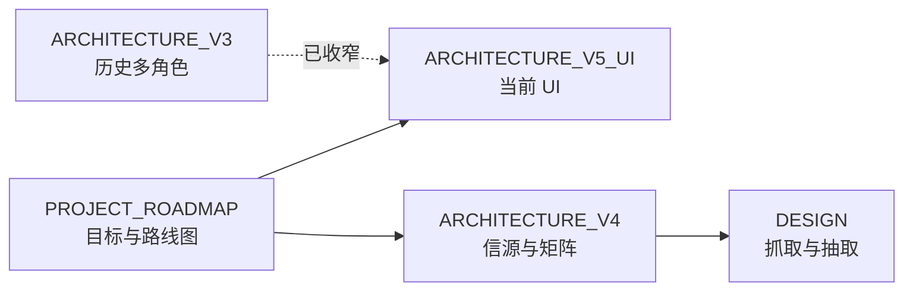

# 文档索引

52 情报站项目文档。建议按阅读顺序：

| 顺序 | 文档 | 说明 |
|------|------|------|
| 0 | [ARCHITECTURE_THINKING_FRAMEWORK.md](./ARCHITECTURE_THINKING_FRAMEWORK.md) | **跨项目通用架构思考框架**（八维 + 触发器 + Checklist） |
| 1 | [PROJECT_ROADMAP.md](./PROJECT_ROADMAP.md) | **项目目标、开发方式、五层现状与路线图**（建议先读） |
| 2 | [ARCHITECTURE_V5_UI.md](./ARCHITECTURE_V5_UI.md) | 当前 UI 与本地构建 |
| 3 | [ARCHITECTURE_V4.md](./ARCHITECTURE_V4.md) | 四层信源、成本矩阵、OCR 闭环 |
| 4 | [DESIGN.md](./DESIGN.md) | 数据源、抽取算法、OCR/ASR 技术调研 |
| 5 | [ARCHITECTURE_V3.md](./ARCHITECTURE_V3.md) | 多角色透镜历史方案（参考，非当前交付） |

## 文档关系

